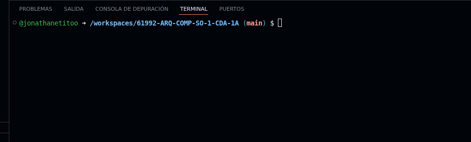

# 61992-ARQ-COMP-SO-1-CDA-1A
Repo for the course

## subtitulo

Hola *mundo*

Chao **mundo**

Hi this is my first chat

## Hey

# Challenge 3

## Terminology

INP = Input

STA = store

LDA = load 

We add the INP , which request the space 000 because the coding line is 0

Then line 1, code STA which will store the previous input I place cell 10, to avoid missunderstandings in the code
It will request the data to room 01 which aligns with the line code 1

Then line 2, code INP, which request the instruction in room 02 because the coding line is 2, also the purpose of this instructions is to request another quantity so it can be added

Then line 3, code ADD 10, set the instruction to he previous input add the number to the one hold in room 10. This instructions in holded in room 3 because the coding line is 3

Then line 4, code OUT, give the instructions to display the result of the operation. This instruction is requested from room 4 which s the same as the coding line.

Then line 5, which is alocated in room 5, gives the instructions to conlude and stope any operation in the machine.

